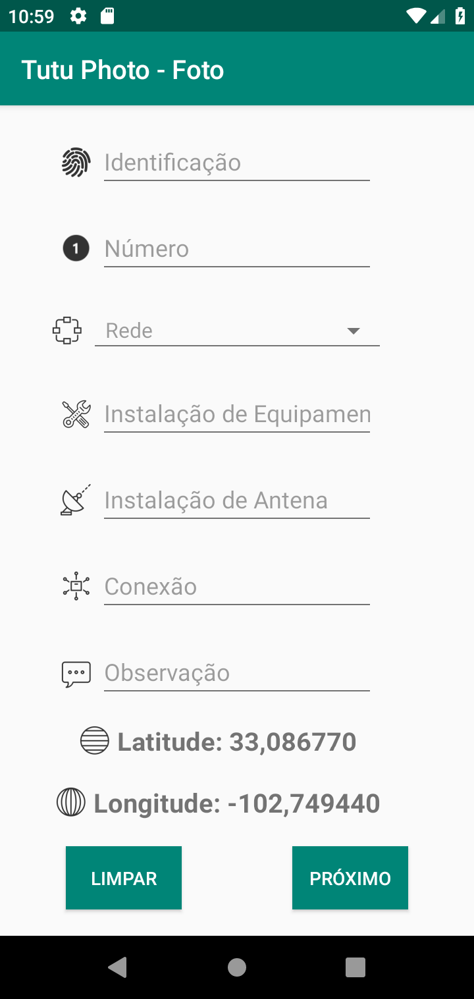
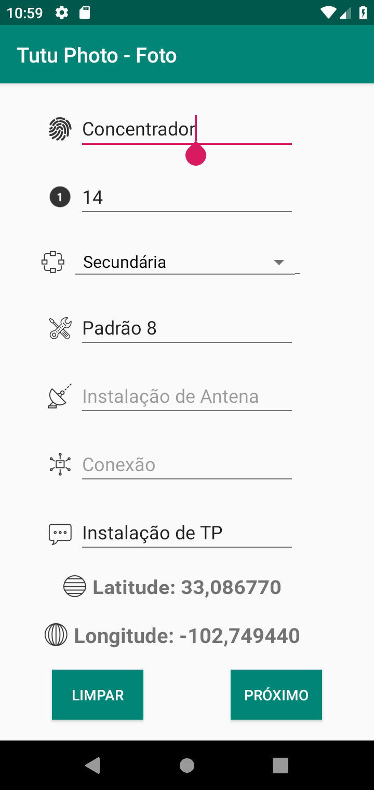
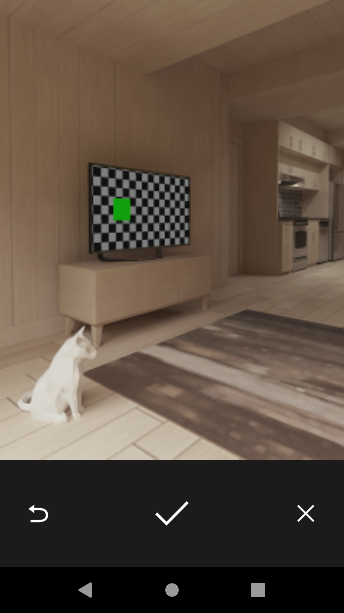
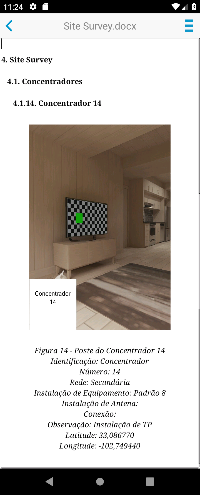

# Tutu Photo

Tutu Photo is a custom Android picture taker. It have been built to simplify the routine of electrical engineers that, routinely, go outside, photograph street poles and write down many information about it.

The app will, automatically make a .docx file with infos, save the original photo file and an edited photo file in the phone and append infos and the edited photo into the .docx file.

## Input

Before taking a picture, the user must decide whether he or she is going to take a picture of the Street Pole or Cardinal Direction. Then, he or she can inform:

### Street Pole

+ ID<strong>*</strong>: 
+ Number<strong>*</strong>: 
+ Network: (primary, secondary or both)
+ Equipment instalation: 
+ Antenna instalation: 
+ Connection: 
+ Observation: 

*_Will be visible in the picture afterwards_

### Cardinal Direction

+ ID<strong>*</strong>: 
+ Number<strong>*</strong>: 
+ Direction: (north, south, west, east)

## Output

+ The user can decline saving the picture and then click again to take another picture.
+ After taking and confirming a picture, the app will store it's raw and edited file at ***/storage/emulated/0/DCIM/Tutu*** with ***TUTU_yyyyMMdd_HHmmss.jpg*** name format for the picture image and ***TUTU_O_yyyyMMdd_HHmmss.jpg*** for the raw picture.
+ A **.docx** file will be created(if not created yet) and filled with all the data previously informed at ***/storage/emulated/0/Documents/Tutu*** with ***Site Survey.docx*** file name.
 
